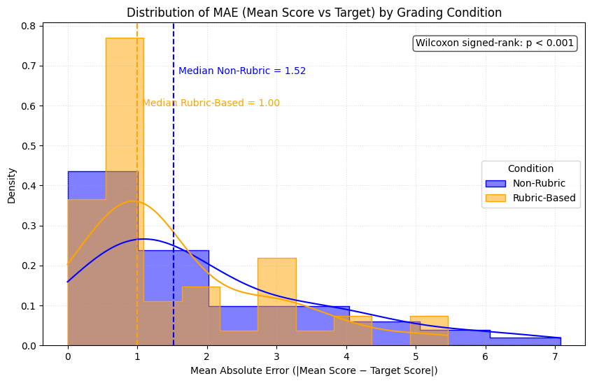
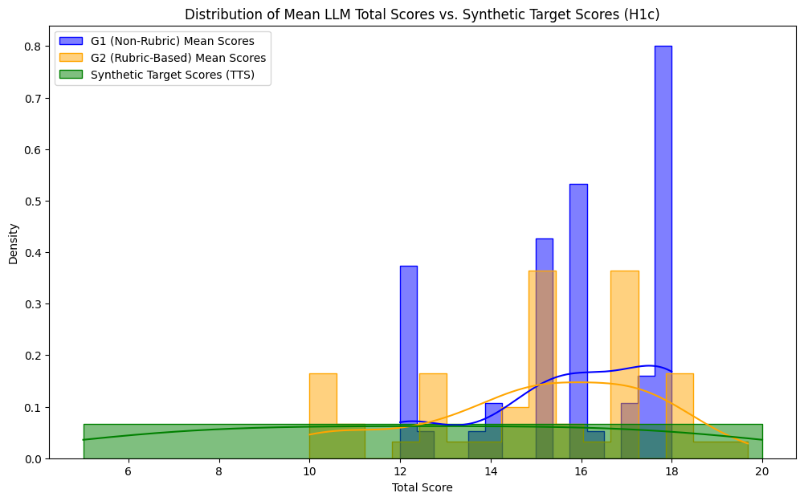

# Experiment 1: Baseline Utility Assessment

## Overview

This experiment evaluated the utility of our LLM-based health communication assessment system by generating synthetic patient-doctor transcripts with known target scores (both total and per-category subscores) and comparing them against LLM-generated assessments using both non-rubric and rubric-based approaches.

## Comprehensive Description

### Purpose

The primary objective of Experiment 1 was to establish a baseline understanding of how well our LLM-based system can assess health communication quality. This was achieved by:

1.  Creating a controlled dataset of synthetic transcripts with predetermined quality scores, including a **Target Total Score** and five corresponding **Target Subscores**.
2.  Evaluating the system's ability to accurately assess these transcripts by comparing LLM-generated scores against the synthetic target scores.
3.  Comparing the consistency (intra-transcript score variation) and accuracy (Mean Absolute Error against target scores) of rubric-based versus non-rubric assessment approaches.
4.  **Critically, evaluating the rubric-based model's ability to accurately assess individual communication sub-skills.**

### Experimental Design

The experiment was structured in three main phases:

1.  **Synthetic Transcript Generation**

    - Generated 50 unique patient-doctor dialogue transcripts.
    - For each transcript, a `TargetTotalScore_Synthetic` (ranging from 5-20) was first established. This total score was then partitioned into five valid **target subscores**, one for each rubric category.
    - The LLM was instructed to generate a transcript reflecting the quality implied by these specific subscores.
    - The generation prompt was refined to produce longer, more realistic dialogues (50-100 turns) with natural turn-taking.
    - Used `gpt-4.1` with temperature=0.7 for synthetic transcript generation.

2.  **Assessment Implementation**

    - Each of the 50 transcripts was assessed 100 times: 50 times using a non-rubric approach (G1) and 50 times using a rubric-based approach (G2).
    - Non-rubric (G1): Direct scoring for a single total score without explicit criteria.
    - Rubric-based (G2): Scoring using the "Patient Health Communication Rubric v5.0", providing scores for all five subcategories and a total score.
    - Assessments were performed using `gpt-4.1-mini` with temperature=0.3.

3.  **Analysis and Evaluation**
    - Collected and processed 5000 total grading attempts (2500 for G1, 2500 for G2).
    - Calculated Mean Absolute Error (MAE) of LLM scores against the `TargetTotalScore_Synthetic` and the target subscores for each method.
    - Calculated the standard deviation (STDEV) of the 50 scores for each transcript under each method (G1 and G2) to assess consistency.
    - Conducted statistical tests (Mann-Whitney U for STDEV, Wilcoxon signed-rank for MAE) to compare G1 and G2.
    - No parsing errors or missing scores were encountered during processing.

### Technical Implementation

- **Synthetic Transcript Generation Model**: `gpt-4.1` (temperature=0.7)
- **Assessment Model**: `gpt-4.1-mini` (temperature=0.3)
- **Assessment Methods**:
  - Non-rubric (G1): Direct scoring based on model's understanding
  - Rubric-based (G2): Structured scoring using "Patient Health Communication Rubric v5.0"
- **Data Processing**:
  - Automated transcript generation and assessment
  - Systematic collection and analysis of results from 5000 grading attempts
  - Statistical analysis of scoring patterns, consistency (STDEV of scores per transcript), and accuracy (MAE against synthetic targets)

### Key Metrics

- Total synthetic transcripts: 50
- Grading attempts per transcript: 100 (50 for non-rubric, 50 for rubric-based)
- Total assessments: 5000
- Target scoring range for synthetic transcripts: 5-20
- Assessment methods: 2 (Non-rubric G1, Rubric-based G2)

### Data Collection

- Generated synthetic transcripts (including `TargetTotalScore_Synthetic` and subscores) were loaded from `data/synthetic/exp1_synthetic_transcripts.csv`.
- Raw assessment results were stored in:
  - `experiments/exp1_baseline_utility/results/exp1_non_rubric_grading_results.csv`
  - `experiments/exp1_baseline_utility/results/exp1_rubric_grading_results.csv`
- Processed results (all 5000 attempts) were combined in:
  - `experiments/exp1_baseline_utility/results/processed_scores/exp1_all_grading_attempts.csv`
- Summary statistics and analysis results were saved to:
  - `experiments/exp1_baseline_utility/results/analysis/exp1_summary_statistics.csv`
  - `experiments/exp1_baseline_utility/results/analysis/exp1_subscore_accuracy_summary.csv`
- Generated plots were saved to `experiments/exp1_baseline_utility/results/analysis/` including:
  - `exp1_stdev_distribution.png`
  - `exp1_mae_distribution.png`
  - `exp1_mean_scores_vs_tts_distribution.png`
  - `exp1_subscore_mae_by_category.png`

### Quality Control

- Implemented checkpointing for transcript generation.
- Refined generation prompts to produce realistic, long-form conversations.
- Automated error handling and validation; 0 rows dropped due to parsing errors or missing scores.
- Consistent model parameters for generation and for assessment.
- Systematic data collection and processing.

## Methodology

- Generated 50 synthetic transcripts with predefined `TargetTotalScore_Synthetic` values (ranging 5-20) and corresponding target subscores.
- Each transcript was graded 50 times using a non-rubric approach (G1) and 50 times using a rubric-based approach (G2).
- All assessments were performed using `gpt-4.1-mini` (temperature=0.3).
- Consistency was measured by the STDEV of the 50 scores for each transcript per method.
- Accuracy was measured by the MAE between the mean LLM score (per transcript/method) and the synthetic target scores (total and subscore).

## Results

### Statistical Analysis

The primary hypotheses focused on consistency (H1a: Rubric-based grading G2 will have lower STDEV) and accuracy (H1b: Rubric-based grading G2 will have lower MAE against target scores).

| Metric                     | Group1 (Non-Rubric) Median (IQR) | Group2 (Rubric-Based) Median (IQR) | Statistic (Test)          | P-Value | Significance | Hypothesis Supported |
| -------------------------- | -------------------------------- | ---------------------------------- | ------------------------- | ------- | ------------ | -------------------- |
| **H1a: STDEV Total Score** | 0.000 (0.266)                    | 0.000 (0.274)                      | U = 1130.0 (Mann-Whitney) | 0.352   | Not Sig.     | No                   |
| **H1b: MAE vs TTS**        | 1.520 (2.000)                    | 1.000 (1.065)                      | W = 238.5 (Wilcoxon)      | 0.00056 | p < 0.001    | **Yes**              |

_TTS: TargetTotalScore_Synthetic_

### Graphical Analysis of Key Metrics

To provide a more intuitive understanding of the results, the following plots visualize the key comparisons between the non-rubric (G1) and rubric-based (G2) methods.

#### Consistency Distribution (H1a)

This plot visualizes the consistency of the two grading methods. It shows the distribution of standard deviations calculated from the 50 repeated gradings for each transcript. Both curves are sharply peaked at or near zero, visually confirming the high consistency reported in the statistical analysis. There is no obvious visual difference between the two methods, which aligns with the non-significant statistical result.

#### Accuracy Distribution (H1b)

This plot compares the accuracy of the two methods by displaying the distribution of Mean Absolute Error (MAE) for the total score. The curve for the rubric-based method (G2, orange) is visibly shifted to the left compared to the non-rubric method (G1, blue), with its peak centered closer to zero. This visually supports the key finding (H1b) that G2 is significantly more accurate, having a lower overall MAE.

#### Overall Score Distributions

This chart compares the overall scoring behavior of both models against the ground truth target scores (TTS). The target scores were intentionally generated with a stratified distribution (peaks in the low, medium, and high ranges), visible in the green curve. In contrast, both the G1 (blue) and G2 (orange) models produce smoother, more normal-looking score distributions. This indicates that while the models' average scores are accurate (as shown by MAE), they may not fully reproduce the specific stratified quality levels of the synthetic dataset, instead tending to score more towards the center of the range.

### Subscore Accuracy Analysis (G2_RubricBased only)

A major goal of this experiment was to determine if the rubric-based model could accurately assess individual communication components. The non-rubric model (G1) does not produce subscores.

The table below shows the accuracy metrics for the G2 model's subscores against the synthetic target subscores.

| Rubric Category                    | MAE       | RMSE      | Correlation |
| ---------------------------------- | --------- | --------- | ----------- |
| Clarity of Language                | 0.714     | 1.036     | 0.555       |
| Lexical Diversity                  | 0.740     | 0.883     | 0.661       |
| Conciseness and Completeness       | 0.892     | 1.082     | 0.318       |
| Engagement with Health Information | 0.627     | 0.935     | 0.608       |
| Health Literacy Indicator          | 0.710     | 0.906     | 0.643       |
| **Effective Total Score**          | **1.543** | **2.041** | **0.913**   |

### Error Distribution Analysis

The following chart provides the most detailed view of model performance. It shows the distribution of the scoring error (Target Score - Actual Score) for the final scores of both the G1 (Non-Rubric) and G2 (Rubric-Based) models, as well as for the individual subscores of the G2 model.

This allows for a direct comparison of both bias and variance:

- **Bias**: A curve's peak relative to the vertical zero-line shows its bias. The G1 Total Score (dashed black line) is centered to the left of zero, indicating a systemic bias towards over-scoring (i.e., Target - Actual is negative). In contrast, the G2 Total Score (solid black line) is centered much closer to zero, indicating lower bias.
- **Variance**: The "peakiness" or narrowness of a curve shows its variance. Sharper, narrower peaks indicate lower variance and higher consistency in the error. The G2 total score curve is noticeably narrower than the G1 curve, visually confirming its lower error.
- **Subscores**: The distributions for the individual G2 subscores are generally well-centered around zero, showing low bias. The spread of these curves aligns with the MAE table: "Engagement with Health Information" has one of the tightest distributions, reflecting its low MAE, while "Conciseness and Completeness" is visibly wider, reflecting its higher MAE and greater uncertainty.

### Key Findings

1.  **Grading Accuracy (MAE vs. TargetTotalScore_Synthetic - H1b)**

    - The rubric-based method (G2) was **statistically significantly more accurate** than the non-rubric method (G1). G2's median MAE of 1.00 was substantially lower than G1's 1.52 (p < 0.001).
    - This provides strong evidence that using an explicit rubric helps the LLM align its assessments more closely with predefined quality standards.
    - The primary hypothesis (H1b) that G2 would be more accurate **was supported**.

2.  **Subscore Assessment Capability**

    - The G2 model successfully generated scores for all five sub-categories, allowing for a granular analysis of its performance.
    - The model was most accurate at assessing "Engagement with Health Information" (MAE ≈ 0.63) and least accurate with "Conciseness and Completeness" (MAE ≈ 0.89).
    - This demonstrates the system's potential to provide detailed, actionable feedback on specific communication skills, a key project goal.

3.  **Grading Consistency (STDEV of scores per transcript - H1a)**

    - Both methods demonstrated high consistency. The median standard deviation for the 50 repeated grades of a single transcript was 0.0 for both G1 and G2.
    - There was **no statistically significant difference** in consistency between the two groups (p ≈ 0.35).
    - The hypothesis that G2 would have lower STDEV was **not supported**, but this is not a negative finding, as both were highly consistent.

4.  **Parsing and Data Integrity**

    - The pipeline demonstrated perfect technical reliability, with no parsing errors or missing scores across all 5000 grading attempts.

## Implications

### Strengths

1.  **Vindication of Rubric-Based Approach**: The experiment confirms that providing a detailed rubric (`G2`) significantly improves assessment accuracy over a holistic approach (`G1`).
2.  **Granular Feedback Potential**: The system can successfully assess individual communication components, not just a single overall score. This is a major step towards providing actionable, educational feedback.
3.  **High Reliability and Consistency**: The entire pipeline is technically robust and the assessment models produce stable scores, which is essential for a reliable tool.
4.  **Improved Synthetic Data**: The refined generation process creates more realistic and challenging transcripts, making these findings more robust.

### Limitations

1.  **Variable Subscore Accuracy**: While the model can assess all sub-skills, its accuracy varies between them. The lower correlation and higher error for "Conciseness and Completeness" suggests this category may be harder for the LLM to interpret or that the rubric definition needs refinement.
2.  **Generalizability to Real Data**: Findings are based on synthetic data where the "ground truth" was created by a related LLM. Performance on real-world transcripts (Experiment 2) and comparison against human experts (Experiment 3) are crucial next steps.

## Recommendations

1.  **Focus on the Rubric-Based (G2) Model**: Given its superior accuracy, future refinement efforts should prioritize the G2 model.
2.  **Investigate Subscore Performance**: Analyze transcripts where the model had high MAE on specific subscores (especially "Conciseness and Completeness") to understand the cause. This could lead to prompt tuning or rubric clarification.
3.  **Proceed with Validation on Real Data**: The promising results from synthetic data strongly justify moving to Experiment 2 (assessment of real transcripts) and Experiment 3 (comparison with human raters). This will test if the accuracy and consistency hold in a more complex, real-world setting.
4.  **Develop Feedback Mechanisms**: Begin designing how the granular subscore data can be presented to users as actionable feedback.

## Conclusion

Experiment 1 successfully established a baseline for our LLM-based assessment system and yielded significant, positive findings. The methodical refinements to the experimental design, particularly the generation of and evaluation against subscores, proved critical.

The results provide strong, statistically significant evidence that a **rubric-based assessment (G2) is more accurate than a non-rubric, holistic approach (G1)** in aligning with predefined quality targets. Furthermore, the experiment demonstrates the system's capability to provide granular assessments of individual communication skills, a key requirement for its intended use as an educational tool.

While both methods were highly consistent, the superior accuracy of the rubric-based approach validates our core hypothesis and provides a clear direction for future work. The next steps will involve validating these promising results on real-world data and beginning to translate these quantitative scores into qualitative, actionable feedback.
