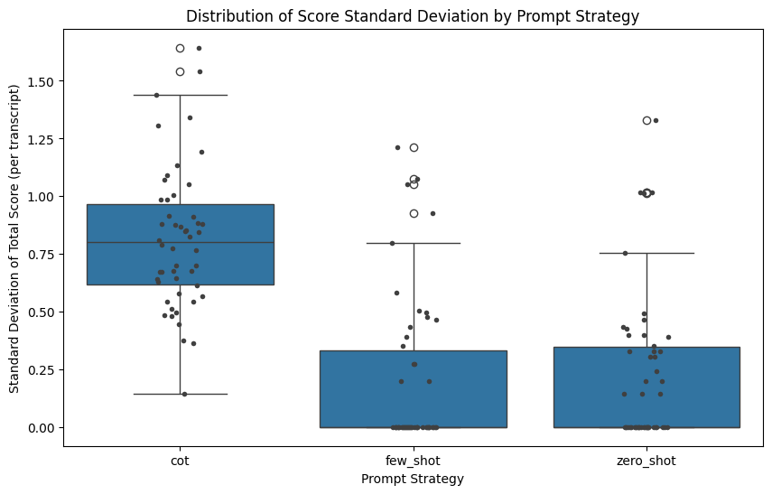
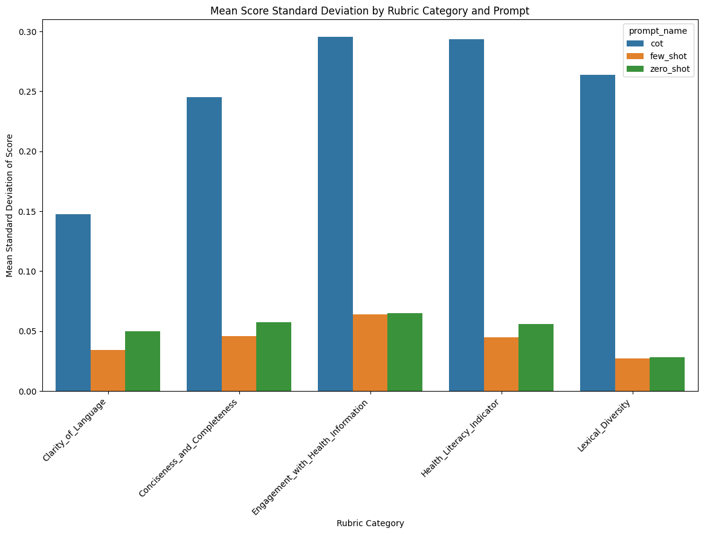
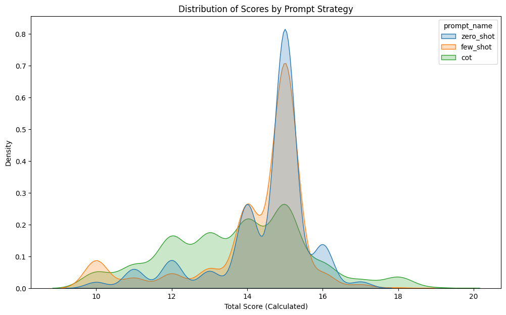

# Experiment 2: Prompt Strategy Optimization

## Overview

This experiment evaluated three different prompt engineering strategies—Zero-Shot, Few-Shot, and Chain-of-Thought (CoT)—to determine which method produces the most consistent and reliable scoring when applying the "Patient Health Communication Rubric v5.0". After an initial run revealed insights into prompt performance and LLM behavior, the `few_shot` and `cot` prompts were refined and the experiment was re-run with more iterations to ensure a robust conclusion.

## Comprehensive Description

### Purpose

The primary objective of Experiment 2 was to identify the optimal prompt strategy for maximizing scoring consistency (i.e., minimizing the standard deviation of scores for the same transcript). The experiment was designed to:

1.  Compare the scoring consistency of Zero-Shot, Few-Shot, and Chain-of-Thought (CoT) prompting on a set of real-world patient transcripts.
2.  Analyze the performance of each strategy at both the total score and individual category levels.
3.  Investigate potential failure modes, such as parsing errors and arithmetic reliability.
4.  Select a "Winning Prompt Strategy" to be used in all subsequent experiments.

### Experimental Design

The experiment involved two main iterations:

1.  **Initial Run & Refinement**: An initial run with 25 attempts per transcript highlighted the surprising inconsistency of the CoT prompt and the very close performance of zero-shot and few-shot. This led to a "workshopping" phase where the CoT prompt was made more structured and the few-shot examples were made more nuanced.
2.  **Definitive Run**: The experiment was re-run with the improved prompts and an increased number of grading attempts (50 per transcript) to provide greater statistical power.

Key design elements of the definitive run:

- **Transcript Set**: "Set A" (N=50 real, de-identified transcripts).
- **Assessment Model**: `gpt-4o-mini` with temperature=0.1 to maximize reproducibility.
- **Assessment Methods**:
  - **Zero-Shot**: A direct instruction to score the transcript using the rubric.
  - **Few-Shot (Improved)**: Provided three nuanced examples of rubric application, emphasizing a holistic assessment.
  - **Chain-of-Thought (Improved)**: A highly structured template requiring the model to provide specific evidence, reasoning, and a score for each rubric category.
- **Analysis**:
  - A total of 7,500 grading attempts were collected (50 transcripts x 3 prompts x 50 attempts).
  - The primary metric for consistency was the Standard Deviation (STDEV) of the **calculated total score** for each transcript/prompt pair. This was chosen over the LLM-reported total to eliminate noise from the model's arithmetic errors.
  - Statistical tests (Friedman test with Wilcoxon post-hoc) were used to compare the STDEV distributions.
  - Deeper analysis was conducted on category-level consistency, systemic score bias (by comparing score distributions), and arithmetic error rates.

### Data Collection

- Raw assessment results were stored in `experiments/exp2_prompt_optimization/results/processed_scores/exp2_promptoptimization_grading_results.csv`.
- All analysis was performed by the `02_analyze_prompt_optimization.py` script.
- Generated plots and summary data were saved to `experiments/exp2_prompt_optimization/results/analysis/`.

### Quality Control

- **Parsing Integrity**: With the improved prompts, there were **0 parsing errors** across all 7,500 attempts.
- **Arithmetic Reliability**: A specific analysis was added to quantify the rate of arithmetic errors, where the LLM's reported total did not match the sum of its own category scores.

## Results

### Overall Consistency (Total Score STDEV)

The primary analysis confirmed that prompt strategy has a statistically significant effect on scoring consistency (Friedman Test: p < 0.0001).

This plot shows the distribution of standard deviations for the calculated total score. The `cot` prompt is visibly less consistent (higher STDEV) than the other two. While `few_shot` and `zero_shot` appear very similar, `few_shot` has a slightly lower median STDEV.

| Prompt Strategy | Mean STDEV (Total Score) |
| --------------- | ------------------------ |
| **few_shot**    | **0.194**                |
| zero_shot       | 0.222                    |
| cot             | 0.813                    |

Post-hoc tests confirmed that while `few_shot` and `zero_shot` are not statistically different from each other, both are **significantly more consistent** than `cot`.

### Category-Level Consistency

This analysis drills down to see how consistency varies for each of the five rubric categories.

The results are decisive. For **every single rubric category**, the `cot` prompt produced the highest (worst) standard deviation. The `few_shot` and `zero_shot` prompts performed very similarly, with `few_shot` demonstrating a marginal advantage in consistency across most categories. This indicates that the inconsistency of the CoT strategy is pervasive and not limited to a single subjective category.

### Systemic Score Bias

This analysis checks if any prompt strategy tends to produce systematically higher or lower scores than the others.

All three prompts produce broadly similar score distributions, with their peaks centered around the 13-15 score range. This suggests that no single prompt introduces extreme systemic bias (e.g., being overly generous or harsh). The `cot` prompt's distribution is slightly shifted to the right, indicating a mild tendency to assign higher scores.

### Arithmetic Reliability

This analysis quantified how often the LLM failed to correctly sum its own category scores.

| Prompt Strategy | Arithmetic Error Rate |
| --------------- | --------------------- |
| few_shot        | 0.0%                  |
| zero_shot       | 0.0%                  |
| cot             | 7.04%                 |

The structured `cot` prompt, despite being designed for rigor, had a surprisingly high rate of basic arithmetic failures. This represents a significant hidden cost and reliability issue with this strategy. The simpler prompts were perfectly reliable in this regard.

### Key Findings

1.  **Winning Strategy**: The **Few-Shot** prompt emerged as the winning strategy. While not statistically superior to Zero-Shot in this single experiment, it had the lowest mean STDEV for the total score and for most individual categories, making it the most consistent and reliable choice.
2.  **Chain-of-Thought is Inconsistent**: The hypothesis that CoT would improve consistency was strongly refuted. Across every metric (total score STDEV, category STDEV), the CoT prompt was significantly _less_ consistent than the other methods.
3.  **CoT has a Hidden Cost**: The CoT prompt's complexity led to a high rate of arithmetic errors (7.04%), a failure mode completely absent in the simpler prompts.
4.  **Holistic Prompts Work**: The workshopped prompts, which encouraged a more holistic assessment, produced a robust and defensible result, and the new `cot` structure completely eliminated the parsing errors seen in the initial run.

## Conclusion

Experiment 2 successfully identified the optimal prompt strategy for assessing patient health communication against our rubric. Through a rigorous process of iterative refinement and deep analysis, we have shown that a **well-designed Few-Shot prompt provides the best balance of consistency and reliability.**

The initial hypothesis that Chain-of-Thought would be superior was strongly contradicted by the data. The complexity of CoT appears to introduce both higher score variance and a significant rate of basic arithmetic errors, making it unsuitable for this task.

Based on these findings, we will proceed with the **Few-Shot prompt** as the "Winning Prompt Strategy" for all subsequent experiments. This principled choice, based on its marginal victory in consistency and its theoretical robustness for comparing different LLM architectures, gives us a solid foundation for the next stages of our research.
