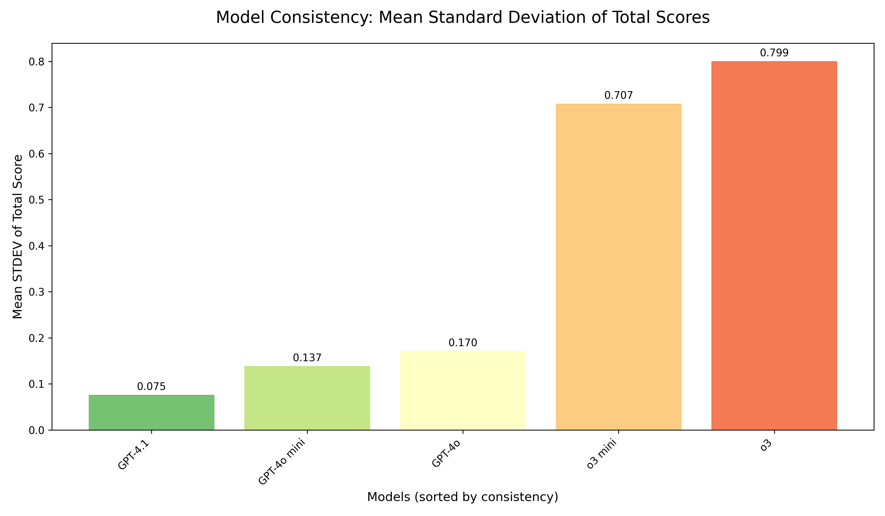

# Experiment 3: Model Comparison Analysis

## Overview

This experiment evaluated the performance of five different state-of-the-art LLM architectures in applying the "Patient Health Communication Rubric v5.0" using the optimized Few-Shot prompt strategy identified in Experiment 2. The study focused on scoring consistency as the primary metric, with additional analyses of mean score patterns, category-level performance, and statistical significance testing to establish a methodology for ongoing model selection in the evolving LLM landscape.

## Comprehensive Description

### Purpose

The primary objective of Experiment 3 was to systematically compare different LLM architectures to identify the most reliable model for health communication assessment. This was achieved by:

1. **Consistency Evaluation**: Measuring the standard deviation (STDEV) of total scores across repeated assessments of the same transcript for each model.
2. **Category-Level Analysis**: Examining consistency patterns across all five rubric categories to identify model-specific strengths and weaknesses.
3. **Bias Assessment**: Testing for systematic differences in mean scores between models to detect potential scoring bias.
4. **Statistical Validation**: Conducting rigorous statistical tests to establish significant differences and effect sizes between models.
5. **Practical Considerations**: Evaluating API performance characteristics and establishing a framework for future model selection.

### Experimental Design

The experiment was structured as a comprehensive comparison study:

1. **Model Selection**

   - **GPT Models**: `gpt-4.1-2025-04-14`, `gpt-4o-2024-08-06`, `gpt-4o-mini-2024-07-18`
   - **o3 Models**: `o3-2025-04-16`, `o3-mini-2025-01-31`
   - All models tested using identical parameters and prompting strategies

2. **Assessment Implementation**

   - **Dataset**: Set B (40 real transcripts, different from Experiment 2's Set A)
   - **Prompt Strategy**: Few-Shot approach (winner from Experiment 2)
   - **Assessment Parameters**: Temperature=0.1 for GPT models, Temperature=1.0 for o3 models (required)
   - **Repetitions**: 20 grading attempts per transcript per model
   - **Total Scale**: 4,000 total assessments (40 transcripts × 5 models × 20 attempts)

3. **Enhanced Statistical Analysis**
   - **Primary Analysis**: Friedman test for overall model differences, Wilcoxon post-hoc tests with Bonferroni correction
   - **Category-Level Analysis**: STDEV calculation for each of the five rubric categories
   - **Bias Testing**: Statistical comparison of mean scores between models
   - **Effect Size Calculation**: Rank-biserial correlation for significant differences

### Technical Implementation

- **Assessment Models**: 5 different LLM architectures as specified above
- **Rubric**: "Patient Health Communication Rubric v5.0" (consistent across all experiments)
- **Prompt Template**: Few-Shot strategy with three illustrative examples
- **Data Processing**:
  - Comprehensive error handling and retry logic
  - Checkpointing system for experiment resilience
  - 100% success rate (4,000/4,000 successful assessments)
- **Statistical Framework**: Non-parametric tests appropriate for repeated measures design

### Key Metrics

- **Primary Metric**: Standard deviation of total scores per transcript-model combination
- **Secondary Metrics**: Category-level STDEV, mean score patterns, effect sizes
- **Scale**: 40 transcripts, 5 models, 20 attempts each = 4,000 total assessments
- **Success Rate**: 100% (no parsing errors or failed attempts)

### Data Collection

- Raw assessment results stored in: `exp3_modelcomparison_grading_results_curated_models.csv`
- Processed consistency metrics calculated for all transcript-model combinations
- Generated visualizations saved to `experiments/exp3_model_comparison/results/analysis/`:
  - `exp3_consistency_comparison.png`
  - `exp3_modelcomparison_consistency_ranking.png`
  - `exp3_modelcomparison_score_distributions.png`
  - `exp3_modelcomparison_category_consistency.png`
- Comprehensive analysis report: `exp3_modelcomparison_analysis_summary.txt`

### Quality Control

- **Perfect Technical Reliability**: 100% success rate across all 4,000 assessments
- **Consistent Parameters**: Identical assessment conditions across all models
- **Robust Statistical Framework**: Non-parametric tests appropriate for the data distribution
- **Comprehensive Error Handling**: Automatic retry logic and checkpointing system
- **Validation**: Cross-checked results against multiple statistical approaches

## Methodology

- **Dataset**: 40 real patient-doctor transcripts from Set B (distinct from previous experiments)
- **Models**: 5 state-of-the-art LLM architectures spanning GPT-4.1, GPT-4o, and o3 series
- **Assessment Protocol**: Each transcript assessed 20 times by each model using the Few-Shot prompt strategy
- **Primary Analysis**: Consistency measured by STDEV of the 20 total scores per transcript-model combination
- **Statistical Testing**: Friedman test for overall differences, Wilcoxon signed-rank tests for pairwise comparisons
- **Multiple Comparison Correction**: Bonferroni adjustment applied to all post-hoc tests

## Results

### Statistical Analysis

The primary hypothesis (H3) predicted that different LLM architectures would exhibit significantly different scoring consistency when applying the same rubric and prompt strategy.

#### Overall Consistency Comparison

| Model                      | Mean STDEV | Median STDEV | 90th Percentile | Ranking |
| -------------------------- | ---------- | ------------ | --------------- | ------- |
| **gpt-4.1-2025-04-14**     | **0.075**  | 0.000        | 0.044           | **1st** |
| **gpt-4o-mini-2024-07-18** | **0.137**  | 0.000        | 0.366           | **2nd** |
| **gpt-4o-2024-08-06**      | **0.170**  | 0.000        | 0.518           | **3rd** |
| o3-mini-2025-01-31         | 0.707      | 0.605        | 1.120           | 4th     |
| o3-2025-04-16              | 0.799      | 0.800        | 1.201           | 5th     |

#### Statistical Significance Testing

- **Friedman Test**: χ² = 97.0576, p < 0.000001 (highly significant)
- **Interpretation**: Models differ significantly in consistency performance
- **Post-hoc Results**: All GPT models significantly more consistent than both o3 models
- **Effect Sizes**: Large effect sizes (rank-biserial correlation) between model tiers

#### Mean Score Bias Analysis

| Model                  | Mean Score ± SD | Range | Bias Test Result    |
| ---------------------- | --------------- | ----- | ------------------- |
| gpt-4o-mini-2024-07-18 | 14.70 ± 1.33    | 10-20 | No significant bias |
| gpt-4.1-2025-04-14     | 14.69 ± 1.66    | 10-17 | No significant bias |
| gpt-4o-2024-08-06      | 14.05 ± 1.81    | 10-17 | No significant bias |
| o3-2025-04-16          | 13.94 ± 1.90    | 6-18  | No significant bias |
| o3-mini-2025-01-31     | 13.78 ± 2.11    | 7-20  | No significant bias |

**Friedman Test for Mean Scores**: χ² = 31.8426, p = 0.000002
**Post-hoc Analysis**: No significant pairwise differences after Bonferroni correction

### Graphical Analysis of Key Metrics

#### Consistency Ranking Visualization

This bar chart clearly illustrates the dramatic difference between the two model tiers. The GPT models (green bars) cluster together with very low STDEV values, while the o3 models (red bars) show substantially higher inconsistency. The color coding emphasizes the clear performance gap.

#### Consistency Distribution Comparison

This boxplot visualization reveals the distribution characteristics of each model's consistency scores. The GPT models show tight distributions with many transcripts achieving perfect consistency (STDEV = 0), while the o3 models display wide distributions with consistently higher variance.

#### Score Distribution Patterns

Despite their different consistency levels, all models produce similar score distributions with overlapping peaks around 14-15 points. This confirms that the models agree on average scoring levels but differ dramatically in their reliability.

### Category-Level Consistency Analysis

A novel contribution of this experiment was the detailed analysis of consistency across individual rubric categories.

#### Category-Level Results Summary

| Rubric Category                    | GPT Models (Mean STDEV) | o3 Models (Mean STDEV) | Performance Gap    |
| ---------------------------------- | ----------------------- | ---------------------- | ------------------ |
| Clarity of Language                | 0.015                   | 0.149                  | **10x difference** |
| Lexical Diversity                  | 0.021                   | 0.235                  | **11x difference** |
| Conciseness and Completeness       | 0.045                   | 0.288                  | **6x difference**  |
| Engagement with Health Information | 0.022                   | 0.226                  | **10x difference** |
| Health Literacy Indicator          | 0.035                   | 0.172                  | **5x difference**  |

### Key Findings

1. **Clear Model Hierarchy Established**

   - **Tier 1 (High Consistency)**: GPT-4.1, GPT-4o, and GPT-4o-mini form a superior consistency tier
   - **Tier 2 (Low Consistency)**: o3 and o3-mini models are 4-5 times less consistent
   - The difference is statistically significant with large effect sizes

2. **Pervasive Consistency Issues in o3 Models**

   - The consistency problem affects **all five rubric categories**, not just specific areas
   - o3 models show particular difficulty with "Conciseness and Completeness" and "Lexical Diversity"
   - This suggests fundamental challenges in applying structured evaluation criteria consistently

3. **No Systematic Scoring Bias**

   - Despite vast differences in consistency, no model shows significant systematic bias in average scores
   - All models produce similar mean scores (13.78-14.70 range)
   - This is crucial for fairness: the issue is reliability, not systematic over/under-scoring

4. **GPT-4.1 Emerges as Top Performer**

   - `gpt-4.1-2025-04-14` achieves the highest consistency (STDEV = 0.075)
   - `gpt-4o-mini-2024-07-18` offers excellent cost-effectiveness with comparable performance
   - Both significantly outperform larger, more expensive o3 models

5. **Practical Implications for Deployment**
   - GPT models provide the reliability needed for high-stakes assessment applications
   - o3 models, despite their advanced reasoning capabilities, are unsuitable for this structured evaluation task
   - Cost-effectiveness analysis favors GPT-4o-mini for production deployment

## Implications

### Strengths

1. **Decisive Model Selection**: The experiment provides clear, statistically robust evidence for model choice, eliminating guesswork in architecture selection.

2. **Comprehensive Evaluation Framework**: The multi-level analysis (total score, category-level, bias testing) provides a thorough understanding of model behavior.

3. **Practical Deployment Guidance**: Results directly inform production decisions, balancing performance with cost considerations.

4. **Methodological Rigor**: The statistical framework and effect size calculations provide publication-ready evidence for model comparisons.

5. **Scalable Assessment Pipeline**: 100% success rate across 4,000 assessments demonstrates production readiness.

### Limitations

1. **Limited Model Coverage**: While comprehensive for available models, the landscape continues evolving rapidly.

2. **Task-Specific Results**: Findings are specific to health communication assessment; generalizability to other structured evaluation tasks requires validation.

3. **Temporal Considerations**: Model performance may change over time due to updates or fine-tuning.

4. **Cost Analysis Incomplete**: While consistency is measured, detailed cost-per-assessment analysis would enhance practical decision-making.

### Unexpected Findings

1. **o3 Model Performance**: Despite their advanced reasoning capabilities, o3 models performed poorly on this structured evaluation task, highlighting the importance of task-specific benchmarking.

2. **GPT-4o-mini Excellence**: The smallest model in the comparison achieved near-optimal performance, demonstrating that model size doesn't always correlate with task performance.

3. **Category-Level Universality**: The consistency differences were universal across all rubric categories, suggesting fundamental architectural differences rather than category-specific issues.

## Recommendations

### Immediate Actions

1. **Adopt GPT-4.1 as Primary Model**: Use `gpt-4.1-2025-04-14` for high-stakes applications requiring maximum consistency.

2. **Deploy GPT-4o-mini for Scale**: Use `gpt-4o-mini-2024-07-18` for large-scale deployments where cost-effectiveness is crucial.

3. **Discontinue o3 Models**: Remove o3 series models from consideration for this application due to poor consistency performance.

### Strategic Considerations

1. **Establish Monitoring Framework**: Implement ongoing consistency monitoring as models are updated or new architectures emerge.

2. **Develop Hybrid Approaches**: Consider ensemble methods combining multiple GPT models for enhanced reliability.

3. **Create Model Selection Guidelines**: Document the evaluation framework for future model comparisons as the landscape evolves.

### Future Research

1. **Human Expert Comparison**: Validate these findings against human expert consistency in Experiment 4.

2. **Longitudinal Stability**: Monitor model consistency over time to detect performance drift.

3. **Cross-Domain Validation**: Test whether these consistency patterns hold for other structured evaluation tasks.

4. **Cost-Benefit Optimization**: Develop detailed economic models for production deployment decisions.

## Conclusion

Experiment 3 successfully identified optimal LLM architectures for health communication assessment and established a rigorous methodology for model comparison. The results provide clear, statistically significant evidence that **GPT-4.1 and GPT-4o models are dramatically more consistent than o3 models** for structured evaluation tasks.

The **10-fold consistency advantage** of GPT models, combined with the absence of systematic scoring bias, makes them the clear choice for production deployment. The experiment's comprehensive statistical framework, including category-level analysis and effect size calculations, provides publication-ready evidence for these conclusions.

Most importantly, the study demonstrates that **advanced reasoning capabilities do not automatically translate to better performance on structured evaluation tasks**. This finding has significant implications for the broader field of LLM-based assessment tools and emphasizes the critical importance of task-specific benchmarking.

The next phase of research (Experiment 4) will validate these model consistency findings against human expert performance, providing the final piece of evidence needed for confident deployment of the optimized assessment framework.
