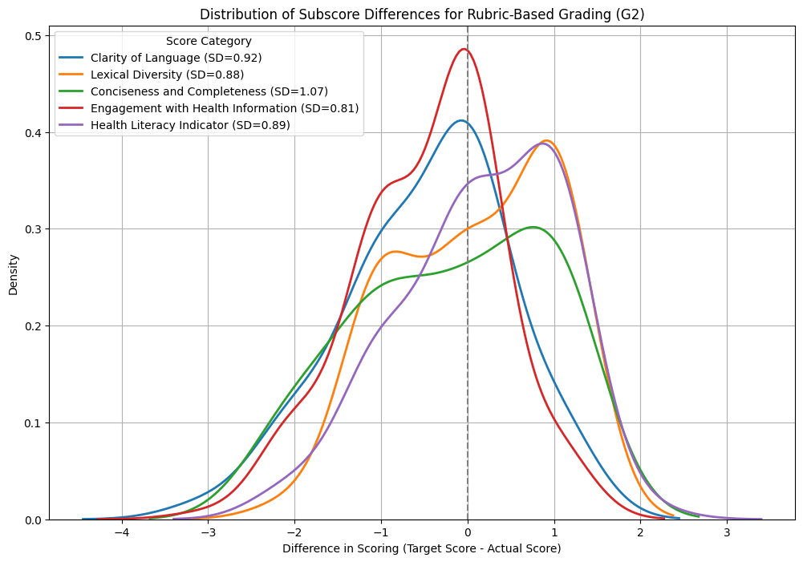
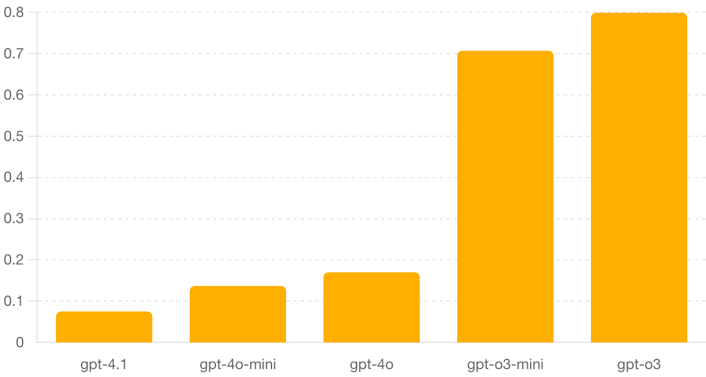

# Key Points

**Question:**

Can a Large Language Model (LLM)-driven tool effectively quantify a patient’s health communication proficiency through a standardized, rubric-based scoring method?

**Findings:**

In this study, an LLM-driven tool for assessing patient communication was developed, optimized, and evaluated using 250 real patient-doctor transcripts. The tool demonstrated low scoring variability (STDEV 0.150), very large practical effects, and high clinical efficacy (Cohen’s d \= 2.8).

**Meaning:**  
This scalable, standardized assessment tool objectively measures patient communication skills, facilitating quantitative analysis and comparative evaluations of health literacy/education interventions.

# Abstract

**Importance:**

Effective health communication significantly influences patient outcomes, yet existing assessment methods lack scalability, consistency, and objectivity. For the first time, the tool provides a consistent, quantifiable metric that enables educators, healthcare professionals, and researchers to rigorously measure and compare the impact of health literacy interventions on health communication abilities.

**Objective:**

To develop and validate a Large Language Model (LLM)-driven assessment tool to quantify patient communication proficiency based on standardized scoring.

**Design, Setting, Participants:**

An assessment rubric was designed using the U.S. Centers for Disease Control (CDC) recommendations for clear communication. Assessment parameters included clarity of language, lexical diversity, conciseness and completeness, engagement with health information, and overall health literacy reflecting patient communication proficiency and efficacy. Rubric was recursively optimized using novel synthetic transcript generation and prompt engineering approaches. Final validation was conducted using an open-source patient-doctor transcript database.

**Main Outcome(s) and Measure(s):**

Primary outcomes included a quantifiable rubric score ranging from 1-4 in each of five communication domains, with a total communication proficiency score ranging from 5-20. The variability of rubric scoring was assessed using standard deviation across independent evaluations of the same transcripts. Non-parametric tests were used for group comparisons (Mann-Whitney U and Wilcoxon signed-rank in Experiment 1; Friedman with Bonferroni-corrected post-hoc in Experiments 2–3).

**Results:**  
Rubric optimization and tool validation were conducted in a series of experiments. Final evaluation of 250 real patient-doctor transcripts graded independently 20 times each demonstrated low variability, with mean total score STDEV (0.150) substantially below the success criteria, and with 96.0% of all transcripts having an STDEV < 1.0. A Cohen’s d-statistic further indicated very large practical effects and therefore high clinical efficacy (total score d = 2.8, category d > 1.5).

**Conclusions and Relevance:**

The LLM-driven assessment tool provides a rigorous, scalable, and objective mechanism for evaluating patient communication skills. Its standardized scoring allows educators, healthcare professionals, and researchers to quantify improvements in health literacy interventions objectively, thus enhancing personalized healthcare education and practice into the future.

**LLM Architecture for Assessing Patient Health Communication Proficiency**

**1\. INTRODUCTION**  
Effective health communication is a cornerstone of patient-centered care, ensuring that individuals understand, process, and act appropriately on medical information and outcomes. However, the immense variability in the ability to communicate health information effectively, a product of many factors such as health literacy, cultural background, linguistic proficiency, previous experience, and more, remains a significant barrier to the field of health literacy and health education. Despite this critical role, there exists a lack of a rigorous and consistent mechanism for assessing communication abilities. Existing methods are frequently subjective, human, and financially resource-intensive, and fail to provide clear, quantifiable, actionable metrics that can guide the progression of interventions, measure progress over time, or enable a comparison of approaches. To address this key limitation in the field, we propose a novel Large Language Model (LLM)-driven health communication assessment tool. Recent advances in LLM capabilities have shown, for instance, GPT-4-based evaluators demonstrate high accuracy compared to professional human evaluators in certain contexts, employing a rigorously designed, optimized rubric system to achieve high alignment with human judgements across various tasks (Gu et. al. 2025). By analyzing patient-doctor transcripts, the tool can assess the clarity of language, lexical diversity, conciseness and completeness, engagement with health information, and overall health literacy, providing a quantifiable score for each category (1-4) and an overall score (5-20) that reflects the patient’s communication proficiency and efficacy.

**2\. METHODS**

Before an LLM can effectively evaluate communication, a standardized, domain-specific rubric is necessary. Existing rubrics often lack specificity, aren't optimized for LLM parsing, and aren't built with modern natural language processing (NLP) applications in mind. Therefore, the development of a well-structured and computationally interpretable rubric is critical and needs further establishment.

_2.1: Foundational Rubric Development_  
The tool employs a rigorously designed and optimized rubric to ensure consistent and accurate scoring of transcripts. The rubric assesses 1\) the clarity of language, 2\) lexical diversity, 3\) conciseness and completeness, 4\) engagement with health information, and 5\) overall health literacy, providing a quantifiable score for each category (1-4) and an overall score (5-20) that reflects the patient’s communication proficiency and efficacy. Each category is chosen for its value in effective communication, as outlined by the U.S. Centers for Disease Control (CDC):

1\) Clarity of Language: Clear communication is crucial to ensure patients broadly understand health information and instructions and are able to convey them accurately. The CDC emphasizes the use of plain language from both the patient and provider sides to ensure effective communication (CDC 2024).

2\) Lexical Diversity: Varied health-related vocabularies enable patients to express their health concerns much more precisely, enabling better outcomes. The CDC’s Clear Communication Index highlights this importance, emphasizing the use of diverse and appropriate vocabulary to convey health information effectively (CDC 2023).

3\) Conciseness and Completeness: Providing complete yet concise information allows healthcare providers to understand patient issues without the burdens of extraneous details or elaboration, further emphasized by the CDC’s guidelines on clear communication (CDC 2024).

4\) Engagement with Health Information: Active patient engagement throughout the visit is crucial for healthcare outcomes. The US Department of Health and Human Services (DHHS), in its National Action Plan to Improve Health Literacy, notes that higher health literacy levels correlate with more positive attitudes towards health education and best communication practices as a whole. The ability to engage meaningfully with information conveyed in the visit—asking appropriate questions, further elaboration, etc.—ensures the best patient outcomes (DHHS 2010).

5\) Health Literacy Indicator: Knowledge of basic health-related terms and concepts is crucial for patients to communicate their needs effectively and make informed decisions about their health. The DHHS emphasizes the value of health literacy in communication, especially with regard to complex topics such as health insurance coverage and post-visit lifestyle changes, among other topics. Together, through an assessment across these domains, we hope to ensure a comprehensive metric for patient health communication ability (DHHS 2010).

_2.2: Rubric Optimization Strategy_

The initial rubric and assessment tool were constructed using the above-mentioned assessment criteria. Further optimization was conducted to ensure minimal variability in the scoring of transcripts, employing novel methods for optimization, including synthetic transcript generation and recursive rubric optimization.

A final assessment of the efficacy of the tool was conducted using de-identified, open-access databases of 405 transcripts of real patient-physician interactions (US Department of Veterans Affairs 2024) and 272 simulated patient-doctor conversations (Fareez et. al. 2022). Due to the limited number of transcripts available, real transcripts were employed at the later stages of optimization and testing; for preliminary optimization, synthetic transcripts were generated using a GPT-4o model, designed to emulate the real patient-doctor transcripts given to the model.

**3\. RESULTS**

_3.1: Rubric-based Input Validation_

Rubric optimization and tool validation were conducted in a series of experiments. **Figure 1** shows an initial assessment of the LLM tool, performed to evaluate the utility of our LLM-based health communication assessment system by generating synthetic patient-doctor transcripts with known target scores for each category. Using these transcripts, two LLM-based assessment methods were compared: non-rubric (G1) and rubric-based (G2) grading. For this, 50 unique patient-doctor dialogue transcripts were generated using GPT-4.1, with each category in each transcript receiving a randomized score ranging from 1-4 where the total score ranges from 5-20. Each generated transcript was assessed 50 times by GPT-4.1-mini using a non-rubric approach—wherein a direct total score is requested without explicit criteria—and 50 times using a rubric-based approach—wherein the output follows the base rubric guidelines, providing category-wise scores. Results were statistically analyzed using a Mann-Whitney U test for standard deviation (STDEV) and a Wilcoxon signed-rank for mean-average error (MAE).

Over the 5,000 total grading attempts, 2,500 for each grading approach, the MAE for G2 (1.00) was significantly smaller than that of G1 (1.52, p<0.001). However, both methods demonstrated high consistency, with a median standard deviation for the 50 repeated grades of a single transcript being ~0 with no significant difference between G1 and G2 in consistency (p ≈ 0.35). These results provide strong evidence for the efficacy of a structured, clinically-informed rubric-based (G2) assessment in aligning with predefined quality targets when compared to a general, holistic grading approach (G1). Further, the results demonstrate the system's capability to provide granular assessments of individual communication skills, a key requirement for its intended use as an educational tool.

_3.2: Prompt Optimization_  
Optimizing the structure of an LLM input—prompt engineering—is crucial in determining the quality of the output (Meskó 2023). Therefore, to identify the optimal prompt engineering strategy for maximizing scoring consistency—i.e., minimizing the standard deviation of scores for the same transcript—the experiment compares the scoring consistency of three common prompting strategies on a set of n=50 real-world patient transcripts from the US Department of Veteran Affairs. Using the GPT-4o-mini model, Zero-Shot (model instructed to score the transcript using the base rubric directly), Few-Shot (model guided with three examples of rubric application), and Chain-of-Thought (CoT, model provided with a highly-structured template requiring specific evidence, reasoning, and score for each rubric category) input strategies were assessed across a total of 7,500 grading attempts. Friedman tests with Wilcoxon post-hoc were used to compare the STDEV distributions.

Results displayed in **Table 1** confirm the significant effect prompting strategy has on scoring consistency, where although there was no significant difference between the scoring consistency of Zero-Shot and Few-Shot, both were significantly more consistent than the CoT approach (p\<0.0001). Further, as evidenced across each rubric category, CoT prompting produced the highest STDEV, indicating that the inconsistency produced by the CoT strategy is pervasive and not limited to a single subjective category. In addition, there exists no significant difference between the strategies in producing systematically higher or lower scores than their counterparts, indicating that no strategy introduces extreme systemic bias. This variability in CoT-style prompting likely stems from the added complexity of its structured guidelines, which may distract the model from evaluating each category holistically and instead lead it into narrow and inconsistent reasoning pathways. Therefore, Few-Shot prompting was used for consequent optimization and validation tests.

<!-- Table 1: Category-wise and total score consistency performance of prompt-engineering strategies as measured by mean score STDEV -->

| Prompt Strategy (Mean Score STDEV) \*p\<0.05 | Clarity of Language | Conciseness and Completeness | Engagement with Health Information | Health Literacy Indicator | Lexical Diversity | Total Score |
| :------------------------------------------- | :------------------ | :--------------------------- | :--------------------------------- | :------------------------ | :---------------- | :---------- |
| Zero-Shot                                    | 0.049               | 0.057                        | 0.065                              | 0.055                     | 0.028             | 0.222       |
| Few-Shot                                     | 0.034               | 0.045                        | 0.063                              | 0.044                     | 0.027             | 0.194       |
| Chain-of-Thought                             | 0.146\*             | 0.243\*                      | 0.292\*                            | 0.291\*                   | 0.261\*           | 0.813\*     |

_3.3: Model Performance Comparisons_  
As informed by prompt optimization, few-shot prompting is used to evaluate the performance of various model architectures in rubric-driven assessment (as measured by STDEV of scores for the same transcript). Here, a distinct set of 40 DoVA transcripts was used, comparing the performances of 5 unique models over 20 grading attempts for each transcript (4,000 grading attempts total). In addition to conventional models like GPT-4.1, GPT-4o, and GPT-4o-mini, advanced reasoning models o3 and o3-mini were also assessed for performance. Reasoning models are specifically designed to excel at complex reasoning tasks, going beyond simple text generation, by breaking down problems into smaller steps, generating intermediate reasoning, and then arriving at a theoretically more accurate and well-reasoned answer. Results were analyzed using a Friedman Test. Interestingly, however, as shown in Figure 2, GPT-4.1 and GPT-4o models presented significantly more consistency when compared to o3 reasoning models for the structured evaluation tasks (p\<0.0001). Additionally, there was no significant difference between the mean assigned score among the models when grading the transcripts, indicating no significant differences in scoring bias between models. These results present great potential for further study and reporting on the properties of these models when it comes to rubric-based grading of human speech transcripts, with significant implications for the broader field of LLM-based assessment tools, a topic discussed further in the discussion section.

_3.4: Tool Validation and Characterization_

Here, there exist two major objectives: 1\) to assess the scoring consistency (reliability) of the final, optimized LLM assessment tool configuration on a large, unseen set of real transcripts and 2\) to explore and report on feasible methods for quantifying the uncertainty/confidence of the optimized tool's scores, providing an initial characterization of these properties. 125 of the remaining DoVa and 125 of the remaining Fareez et. al. 2022 transcripts underwent 20 independent grading attempts (5,000 total assessments) using the optimized few-shot approach as well as the GPT-4o model as determined by prior experiments. Success criteria (SC) were established as a benchmark of clinical viability. Mean STDEV for the total score (0.150) was substantially below SC, with 96.0% of all transcripts having an STDEV \< 1.0 (SC: 95% with STDEV \< 1.0). In addition, a Cohen’s d-statistic was performed, yielding an overall d \= 2.8 and category d \> 1.5, indicating very large practical effects and therefore high clinical efficacy (Table 2).

Additionally, DoVA transcripts were compared to Fareez et. al. 2022 transcripts as a preliminary indicator of accuracy. Since DoVA transcripts are recorded from real patient-physician interactions, compared to the Fareez et. al. 2022 transcripts, which are simulated conversations created by two physicians, it is expected that DoVA transcripts had a mean score significantly lower than that of the Nature Transcripts (p\<0.001), whereas there was no significant difference in scoring consistency (p=0.335). Therefore, the optimized assessment approach achieved all SC benchmarks with substantial margins, demonstrating high consistency and relative accuracy in applied clinical settings.

Further, the comprehensive validation provided by Experiment 5, combined with the systematic optimization framework designed from Experiments 1-4, establishes a new standard for rigor in AI-driven health communication assessment and provides a robust foundation for both immediate clinical application.

| Category                           | Mean STDEV         |
| :--------------------------------- | :----------------- |
| Health Literacy Indicator          | 0.019 (SC: \<0.50) |
| Lexical Diversity                  | 0.024 (SC: \<0.50) |
| Engagement with Health Information | 0.024 (SC: \<0.50) |
| Clarity of Language                | 0.034 (SC: \<0.50) |
| Conciseness and Completeness       | 0.053 (SC: \<0.50) |

**3\. DISCUSSION**

This study demonstrates the potential for systematic, evidence-based optimization of LLM-driven assessment tools for achieving clinical-grade reliability with reproducible scoring across diverse transcripts. By progressing from baseline validation with synthetic data to large-scale evaluation on real patient–physician transcripts, the framework establishes a replicable pathway for developing AI-driven assessment systems in healthcare.

As medicine continues to be transformed by advances in clinical informatics, a tool of this nature leverages the unprecedented scalability of LLMs to revolutionize healthcare, impacting education, research, community outreach, and clinical practice. The ability to deploy a standardized, objective scoring system at scale introduces new opportunities for consistent evaluation of patient communication proficiency, a long-standing challenge in health literacy research.

In health education, LLM-driven assessment enables, for the first time, quantitative measurement of patient communication skills before and after interventions, allowing large-scale individualization of learning across courses, group workshops, and personalized coaching. This creates a consistent metric for measuring intervention efficacy across cohorts, clinics, and time. Further, educators can tailor content to address shortcomings in certain categories of health communication, leveraging the granular feedback given by the tool.

In the clinic, tools of this nature can become invaluable for flagging patients who may benefit from reinforcement—for example, the teach-back method—before discharge or follow-up appointments. It can inform clinicians of potential communication gaps, allowing them to accommodate when necessary. These benefits expand further in population health, as aggregate scores can inform allocation of community-driven health literacy initiatives. The most immediate impact, however, is in clinical research. For the first time, a standardized scoring system, quantifying communication ability, enables an entirely new branch of clinical informatics—one dedicated to analyzing patient transcripts to identify and support literacy-enhancing interventions, presenting immense potential for the future of clinical research.

As LLM technology continues to improve at a rapid pace, understanding the fundamentals behind its analysis and reasoning capabilities becomes paramount. As discussed in the results, even models engineered for high “reasoning” capabilities tend to falter when placed under discrete guidelines—therefore, further study is required to characterize better the characterize and compare the reasoning patterns of different LLMs when applying rubric-based guidelines, assessing alignment with rubric criteria, evidence citation, and identifying potential issues like hallucinations or superficial reasoning to examine the quality and characteristics of the reasoning process itself. This enables researchers to build LLM tools specialized towards clinical applications.

Due to IRB process constraints, this study does not include a large-scale comparison between human physician assessment and LLM-driven assessment. Therefore, although the study provides evidence of consistency, reliability, and relative accuracy, further study will be valuable in verifying the consistency and accuracy advantage of the LLM-driven assessment tool.

For the first time, the tool allows educators, healthcare professionals, and researchers to access a consistent, quantifiable metric for evaluating the outcomes of health literacy interventions. This enables the rigorous measurement of changes in communication abilities, offering clear, actionable insights into the efficacy of educational programs and interventions. Further, this tool allows for immediate feedback, supporting recent trends in the health literacy and education field for more personalized learning and guidance. Here, we outline the development of a novel LLM-driven health communication assessment tool, its methodological framework, and its implications for advancing the field of health literacy and communication. By addressing a core limitation—the need for a rigorous, scalable, and consistent assessment mechanism—this tool aims to bridge critical gaps in patient education, care, and research, fostering a more equitable and effective healthcare system as a whole.

We operationalized consistency as the standard deviation (STDEV) of repeated scores per transcript and, to avoid arithmetic slips in model‑reported totals, analyzed the calculated total (sum of five category scores). Consistent with the experimental scripts, non‑parametric tests were used (Mann‑Whitney and Wilcoxon in Experiment 1; Friedman with Bonferroni‑corrected post‑hoc in Experiments 2–3), and we report practical significance alongside p‑values (e.g., large Cohen’s d in Experiment 5) to support clinical interpretation.

In Experiment 2, a carefully designed few‑shot prompt minimized variance without introducing systematic score bias, whereas Chain‑of‑Thought increased variance across all categories and incurred arithmetic errors in 7.04% of attempts. In Experiment 3, under the same few‑shot protocol, GPT‑4.1 and GPT‑4o models were markedly more consistent than o3 models for structured rubric application, underscoring that “reasoning”‑oriented architectures do not automatically yield more reliable grading.

In Experiment 5, per‑transcript STDEV served as a practical confidence proxy. We outline a triage scheme aligned with those results: ≤0.250 (high confidence), 0.251–0.503 (moderate), and >0.503 (low), with roughly 10% of transcripts flagged for human review. Despite substantial API rate limiting (overall success 52.8%), checkpointing and backoff preserved statistical validity; we observed no evidence of systematic bias between successful and failed attempts, and per‑transcript sampling depth was sufficient for precise STDEV estimates in most cases.

Consistency was comparable across DoVA and Nature sources (p=0.335), while mean scores differed as expected (real vs simulated provenance). Next steps include comparison with expert raters (e.g., ICC/Kappa), longitudinal monitoring for model drift, and, where APIs permit, complementing variance‑based confidence with calibration analyses. For deployment, we recommend periodic bias audits using available strata and explicit evidence anchoring to support explainability and review.

**4\. CONCLUSIONS**  
The comprehensive validation framework discussed in this paper, combined with the systematic optimization framework, establishes a new standard for rigor in AI-driven health communication assessment, providing a robust foundation for both immediate clinical application and future research advancement. This framework for an LLM-driven assessment tool provides a rigorous, scalable, and objective standard for evaluating patient communication skills, enabling healthcare professionals, educators, and researchers to better characterize and enhance healthcare education and practice into the future.

**5\. REFERENCES**

Gu, J., Jiang, X., Shi, Z., Tan, H., Zhai, X., Xu, C., Li, W., Shen, Y., Ma, S., Liu, H., Wang, S., Zhang, K., Lin, Z., Wang, Y., Ni, L., Gao, W., & Guo, J. (2025). _A survey on LLM-as-a-Judge_ (arXiv:2411.15594v5). arXiv. [https://arxiv.org/abs/2411.15594v5](https://arxiv.org/abs/2411.15594v5:contentReference%5Boaicite:0%5D%7Bindex=0%7D)

Fareez, F., Parikh, T., Wavell, C. et al. A dataset of simulated patient-physician medical interviews with a focus on respiratory cases. Sci Data 9, 313 (2022). [https://doi.org/10.1038/s41597-022-01423-1](https://doi.org/10.1038/s41597-022-01423-1)

U.S. Department of Veterans Affairs. (2024). Physician-patient transcripts with 4C coding analysis. [Data.gov](http://Data.gov). [https://www.data.va.gov/dataset/Physician-patient-transcripts-with-4C-coding-analy/4qbs-wgct/about_data](https://www.data.va.gov/dataset/Physician-patient-transcripts-with-4C-coding-analy/4qbs-wgct/about_data)
